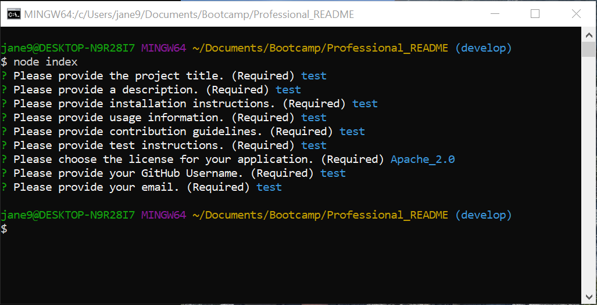

# Professional README Generator


## Table of Contents
* [Description](#description)
* [Installation](#installation)
* [Usage](#usage)
* [Contributing](#contributing)
* [Tests](#tests)
* [License](#license)
* [Questions](#questions)

## Description <a name="description"></a>
This application receives user input through the command line to generate a professional README.  The README includes Project Title, Table of Contents, Project Description, Installation Instructions, Usage Instructions, Contributing Information, Test Instructions, License Information, and a Contact Section.  All sections are required input to maintain the standard for professional README's.  Some prompts require user input while others have a default input that may be selected.

## Installation <a name="installation"></a>
To install this application, please do the following: 

1. Clone the application's respository from GitHub onto your local drive.  
2. Set up the npm package by typing the following into the root directory of the application: 
    
    ```
    npm install
    ```
    
    This will download the application's dependencies into your root directory.  You should now have a folder called ```node_modules``` and a file called ```package-lock.json```.

## Usage <a name="usage"></a>
Once installation is complete, to use the application, type the following into the command line at the root directory of the application:

    node index
    
The application will prompt you for a series of requirements to be input into your project README.  You should be prompted for input as shown in the screenshot below.



Once all input has been provided, the application will generate a ```README_new.md``` file.

For a video walkthrough of the installation and usage procedures, please go to the following link:
https://drive.google.com/file/d/1mxueZR9qDYzQRES6-Hchr3lcx7u04o_A/view

## Contributing <a name="contributing"></a>
Contributions are welcome.  Please contact me regarding improvements you would like to make.

## Tests <a name="tests"></a>
There are currently no test instructions.

## License <a name="license"></a>
This application is covered under the MIT license.

## Questions <a name="questions"></a>
My GitHub username is plainjane99.  Please feel free to peruse my other projects.

If you have any questions regarding this application, please contact me via email at jane99hsu@gmail.com.
  